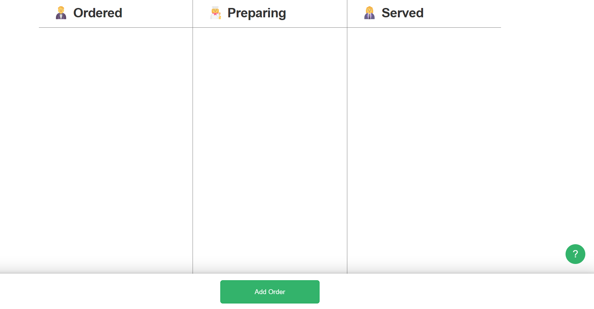

# IWA_18.4: Challenge 1

This final exercise is a much larger and more complex than previous exercises. The goal is to adequately prepare you for the culminating week-long Capstone Project that you are required to submit, to successfully meet the outcomes for this course.

In this challenge, you are provided with all HTML, CSS and JavaScript code used in a web app called “Kitchen Express”.

It is a product that will be sold to restaurants to help them track customer orders from the moment they are taken by a waiter until they are finally served to the customer. It also records the table number and the exact time that the order was created.

All previous HTML, CSS and JavaScript files were created by a senior JavaScript developer. Unfortunately, they just phoned saying that they caught the flu and that the doctor told them to stay in bed for the remainer of the week. This means that the responsibility now falls on you to complete the remaining sections of the code so that the product can still be launched this week.

Luckily the team is happy with everything that has been created up until now. This means that you will only have to modify the scripts.js file, where most of the event-specific behaviour is located. All event listeners and handlers have been created already. However, only the first handleDragOver handler’s logic has been written and documented. You will be required to add the logic for all remaining event handlers (making use of the data.js and view.js file exports) to ensure that the following user stories are met:

The “Add Order” button should start as focused, meaning space/enter can be pressed immediately to add an order.
Click the “?” icon should open a “Help” overlay that provides instructions on how to use the app.
If the “Help” overlay is open, clicking the “Close” button should remove the overlay.
If any overlay is closed the focus should be returned to the “Add Order” button.
Clicking “Add Order” should open an “Add Order” overlay that allows the entering of order text and an associated table.
Clicking “Cancel” in the “Add Order” overlay should remove the overlay without adding the information as an order.
Clicking the “Add” button in the “Add Order” overlay should remove the overlay and add a new order to the “Ordered” column.
If the “Add Order” overlay is closed (either with “Cancel” or “Add”) and it is opened again it should be blank (not have information from the last time it was opened).
If an order has been added and it is clicked on the “Edit Order” overlay should appear.
If the “Delete” button is pressed in the Edit Order overlay the overlay should be closed and the order should be removed entirely.
If the “Cancel” button is pressed in the “Edit Order” overlay it should close the overlay without applying the changes entered into the overlay inputs.
If the “Update” button is pressed in the “Edit Order” overlay it should close the overlay and apply the changes entered to the relevant order.
If the “Status” value is changed and “Update” is pressed in the “Edit Order” overlay then the order should be moved to the column selected in the dropdown.
 

Please view the 'Further Reading' section below for additional reading material and tools to help you complete this challenge.